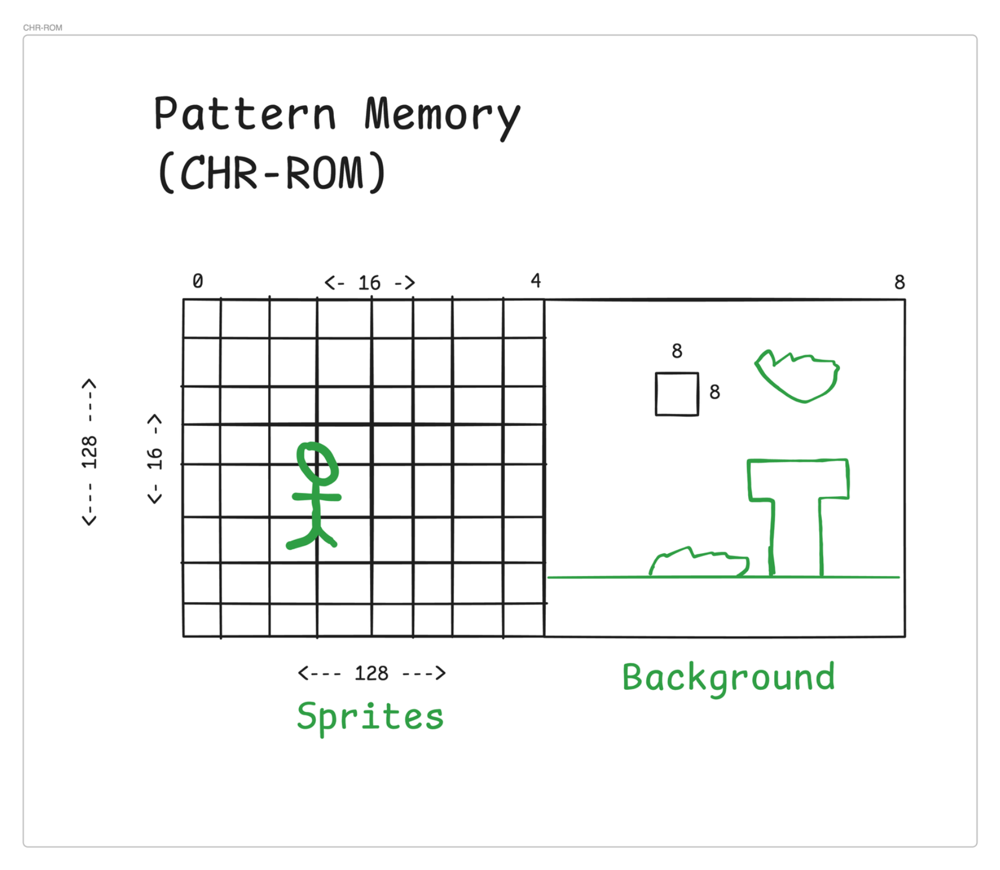
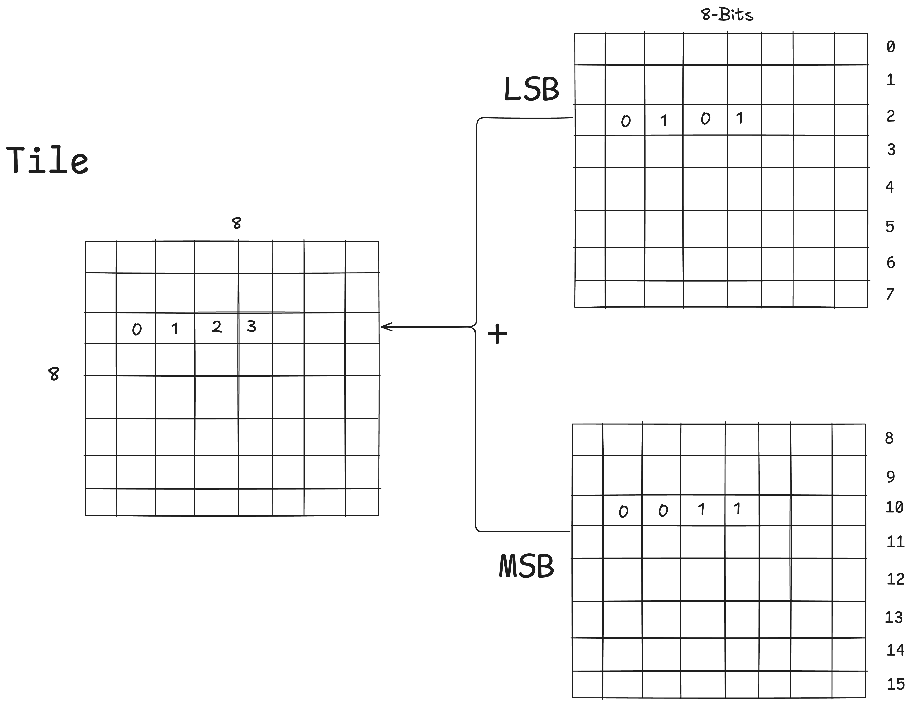
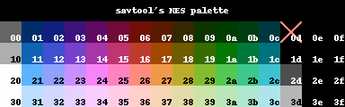

# Graphics

## Pattern Memory (CHR-ROM)

Pattern Memory is 8Kb and can split in 2 section of 4Kb and each is split in a 16x16 grid of sprite
A tile is 8x8. So the "left" side is 128x128 (16x16 * 8x8).

The PPU can select between the left side or the right side of the memory.
8x8 tiles is not so much so elements (sprite) can use multiple tiles.

It’s common to split CHR memory: one half is used for sprites, the other for background tiles.

Anecdote: In SBM (Super Mario Bros.) due to the limited amount of tiles, clouds tiles are the same as the bushes, just with different color.

So tiles can be reused.

## Tiles

A tile is a 8x8 bitmap with two bytes for each tile row. So you have the choice of 4 colors per pixel.
A pixel can get the value: 0, 1, 2, 3
This value is the sum of LSB (Least Significant Byte) and the MSB (Most Significant Byte).

When you identify where the tile offset is you just need to read the next 16 bytes to get the whole tile.

The 2 bytes of the tiles is not enough to specify colors, we need to combined it with the palette.

## Palettes

The palettes memory look like this:

| ID  | Background Palette | Bytes | Examples |
|:---:|:-----------------|:------|:--------|
|     | $3F00             | 1     | 🟦 |
| 0   | $3F01             | 4     | 🟨🟧🟩✖ |
| 1   | $3F05             | 4     | ⬜⬜⬜✖ |
| 2   | $3F09             | 4     | ⬜⬜⬜✖ |
| 3   | $3F0D             | 4     | ⬜⬜⬜✖ |
|     | **Foreground Palette** |    |      |
| 4   | $3F11             | 4     | ⬜⬜⬜✖ |
| 5   | $3F15             | 4     | ⬜⬜⬜✖ |
| 6   | $3F19             | 4     | ⬜⬜⬜✖ |
| 7   | $3F1D             | 4     | ⬜⬜⬜✖ |

⬜ -> is any color in the NES Palette.

For each palette (except BG Color), the 4th byte (✖) is a *mirror* (link) to the background color. 

By example, if I want the background color to be  **Cyan**, I need to set $3F00 to **0x2c**

## PPU

A NES frame = 262 scanlines * 341 cycles per line = 89 342 PPU Cycles

Scanline -1: PRE-RENDER (Clean before draw)
Scanline 0-239: VISIBLE (What we see)
Scanline 240: POST-RENDER (Empty line)
Scanline 241-260: VBLANK (CPU can modify VRAM)

Total: 262 scanlines

---

### Cycles

Each PPU cycles is a "dot" on the screen.
341 cycles: time to draw a line.
Cycles 0-255: draw visible pixel
Cycles 256-340: Prep for next line.
Reset Cycles to 0 and Scanline +1.
Repeat the process

### Scanline

262 scanlines per frame.
If Scanline is superior to 260, we reset scanline to -1, and we add +1 to frame_counter.

#### PRE-RENDER

If PPU cycle = 1, we clear VBlank flag, clear Sprite 0 hit and clear Sprite Overflow.

#### Visible Scanline

If PPU scanline is b/w 0 and 240 we render each pixel.
<!-- TODO: Explain how render each pixel -->

#### POST-RENDER

Do nothing lol. ⸜( ˃ ᵕ ˂ )⸝

#### VBlank

If PPU scanline is egal to 241 we set the VBlank Flag and say the frame is ready to be draw, activate NMI if activate. [ppu.c L222-229](https://github.com/squach90/CuneNES/blob/main/src/ppu.c#L222-L229)

During the VBlank the CPU: Load new tiles, Update sprite position, Change palette, Modify scrolling